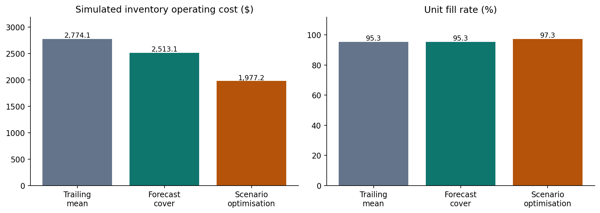

# Retail Demand Forecasting & Inventory Optimisation

**From 28-day demand forecasts to weekly replenishment decisions under a purchasing budget.**

Python · SQL / SQLite · Local PySpark · scikit-learn · SciPy / HiGHS · Mixed-integer optimisation

This project connects forecast accuracy to an operational decision: how much stock to order across 60 food products at M5 store CA_1. It combines time-based backtesting, a cross-validated feature pipeline and a replenishment simulation that makes the service-versus-inventory trade-off explicit.

## Results at a glance

| Base-case measure | Trailing-mean cover | Scenario optimisation |
|---|---:|---:|
| Simulated holding + stockout cost | $2,774 | **$1,977** |
| Unit fill rate | 95.27% | **97.29%** |
| Average inventory value | $3,655 | **$4,814** |
| Purchasing spend | $51,247 | $53,128 |

The optimiser reduced simulated operating cost by **28.7%**, with **31.7% higher average inventory value**. All 108 optimisation solves across nine budget/lead-time scenarios reached optimal solver status; no review exceeded its purchasing budget. Costs and starting inventory are assumed. These are historical simulation results, not realised company savings.



### Forecast accuracy

| Forecast | Mean test WAPE | Mean test RMSSE |
|---|---:|---:|
| Weekly seasonal naive | 50.61% | 0.879 |
| Weekday average, 56 days | **43.72%** | 0.723 |
| Gradient boosting, selected on validation | 43.91% | **0.698** |

Boosting won on validation and was retained for the operational simulation. The simpler weekday average had slightly lower test WAPE. Reported RMSSE is an unweighted average over the selected products, not the official M5 WRMSSE score.

## Explore the work

- [Executed notebook](Forecast_Analysis.ipynb): analysis outputs and explanation, viewable on GitHub.
- [Results report](Forecast_Results.html): download and open in a browser for the self-contained operations report; GitHub itself displays the HTML source.
- [Detailed methodology](docs/METHODOLOGY.md), [data dictionary](docs/DATA_DICTIONARY.md) and [data sources](data/README.md).
- [Forecast backtests](results/forecast_metrics.csv), [inventory sensitivity](results/inventory_sensitivity.csv) and [solver/budget logs](results/inventory_orders.csv).
- [SQL feature definitions](analysis.sql) and [feature-engine audit](results/feature_audit.json).

## Pipeline

1. Freeze a training-selected cohort: 20 established food products per department, 60 in total.
2. Join daily sales, calendar and weekly prices into **114,780 item-day observations**.
3. Build trailing features using local PySpark, and verify parity against pandas and SQLite; export partitioned Parquet.
4. Compare three forecasting methods across three 28-day validation windows and three later test windows.
5. Refresh forecasts at weekly order reviews and choose integer replenishment quantities using 48 demand scenarios and a shared purchasing limit.
6. Evaluate fill rate, lost sales, inventory value, purchase outlay and operating cost across nine operational scenarios.

Every training target ends by its forecast origin. Future sales and future prices do not enter predictors. Earlier completed test windows can become training history in later walk-forward windows.

## Reproduce locally

Use **Python 3.12**. From the repository root:

```bash
python -m venv .venv
```

Activate with `.venv\Scripts\Activate.ps1` in Windows PowerShell or `source .venv/bin/activate` on macOS/Linux. The core version runs without Java or Spark:

```bash
python -m pip install -r requirements.txt
python prepare_data.py
python build_features.py
python run_analysis.py
python test_analysis.py
```

Preparation downloads approximately 50 MB from the documented archive mirror, then creates the fixed subset. Raw files, databases and row-level feature exports are generated locally and ignored by Git. Source checksums are recorded in [data/provenance.json](data/provenance.json).

### Reproduce the Spark feature build

Install Java 17, then:

```bash
python -m pip install -r requirements-spark.txt
python build_features.py --spark
python run_analysis.py
python test_analysis.py
```

The committed reference outputs were generated from verified **local PySpark 3.5.7** features. The core pandas rebuild can produce small numerical differences in tree forecasts because floating-point differences affect tree splits. Each run records the actual feature engine. This is a local demonstration, not a distributed production deployment. Spark on Windows may need additional Hadoop configuration; the core route avoids that dependency.

Refresh the report and executed notebook after an analysis run with:

```bash
python build_deliverables.py
```

The notebook reads the generated outputs by default. Set `REBUILD=True` in its first code cell to rerun the model and simulation. Open it with the repository root as its working directory.

## Repository map

| Path | Purpose |
|---|---|
| `prepare_data.py` | Download, frozen cohort selection and provenance |
| `build_features.py`, `analysis.sql` | Joined panel, rolling features and cross-engine validation |
| `run_analysis.py` | Backtests, residual intervals and inventory optimisation |
| `test_analysis.py` | Future-data isolation, metrics, budgets and a known optimisation problem |
| `results/` | Reference model metrics, audits, decision logs and figures |
| `docs/` | Detailed assumptions and variable definitions |
| `report_theme.py`, `report_style.css` | Self-contained report layout |
| `.github/workflows/analysis.yml` | Core pipeline and tests on pushes and pull requests |

The hosted workflow uses the pandas/SQLite feature path and requires access to the source archive. It does not run Spark. Its first hosted run occurs after repository publication.

## Decision limits

Historical sales proxy demand, so unobserved stockouts may censor true demand. Procurement cost, holding cost, shortage penalty, lead times and opening inventory are assumptions. The optimiser chooses from finite candidate quantities under a simplified protection-period objective; it does not solve the full dynamic inventory-control problem. Nominal 80% residual intervals undercovered on the test data.

The cohort favours established, relatively high-volume products at one store. Cross-lead-time comparisons also change initial stock; compare policies within each scenario. A business pilot needs actual inventory records and cost assumptions before using the ordering policy.
